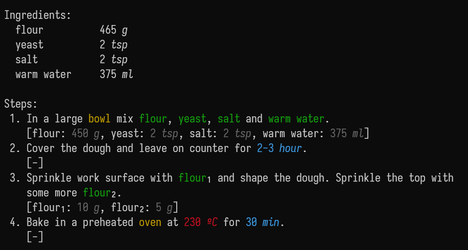
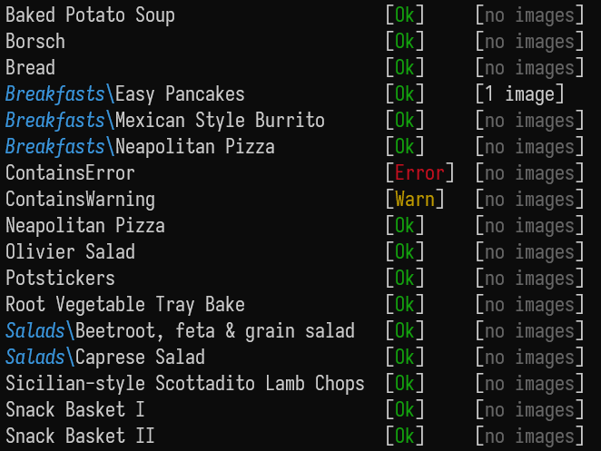
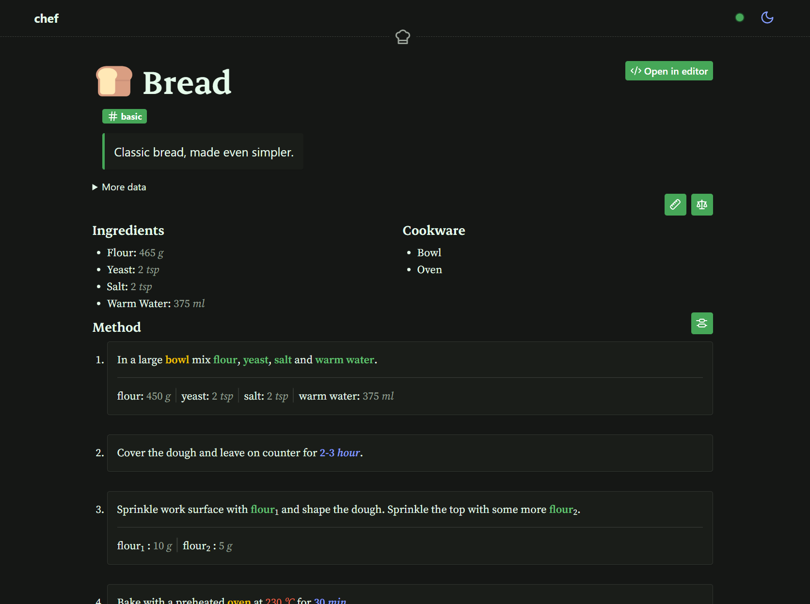

# The `cooklang-rs` CLI

The CLI is currently named `chef`. This may change. I don't want to
call it `cook` to avoid using the same name as the original `CookCLI`.

## Key features
- Read a recipe:
    ```sh
    chef recipe Bread.cook
    ```
    
    You can also specify a `markdown`, `json` or back to `cooklang` output.

- List all recipes, even check if they contain errors.
    ```sh
    chef recipe list --long
    ```
    

- Quick conversions
    ```sh
    chef convert 3 cups metric
    ```

- Web UI
    ```sh
    chef serve --open
    ```
    This starts a web server and opens it in the default web browser. You can
    edit the recipe files and it will automatically update the web on save.
    The web server also exposes a REST API for the recipes.

    
    
    This is intended for personal or home use for a couple or reasons:
    - No strict protection is used.
    - There is no caching, so every request the recipe file is read from the
    disk and parsed.

## Installing
### Prebuilt binaries
For now, prebuilt binaries are not distributed. However, maybe in
[the releases page](https://github.com/Zheoni/cooklang-rs/releases) you
can find one for Windows.

### Compiling the CLI
1. Install the rust compiler and `cargo`, the best way is with
    [rustup](https://rustup.rs/).

    Also, if you want to compile the web UI, you need to install [node](https://nodejs.org/) and [pnpm](https://pnpm.io/).
2. Clone [this repo](https://github.com/Zheoni/cooklang-rs).
    ```sh
    git clone https://github.com/Zheoni/cooklang-rs
    cd cooklang-rs
    ```
3. Go into the `cli` dir
    ```sh
    cd cli
    ```
4. Build the web UI

    *This is only required if you want to include it in the binary.*
    ```sh
    cd ui
    pnpm install
    pnpm run build
    ```
5. To install it run **ONE** of the following:
    ```sh
    # enable everything
    cargo install --path .

    # no `serve` cmd (and no web UI)
    cargo install --path . --no-default-features

    # `serve` cmd but no web UI only the rest API
    cargo install --path . --no-default-features --features "serve"
    ```

    If the `ui` feature is enabled and there is no `ui/build` dir, it will
    result in a compile error.

    This will install the cli in the `cargo` install dir, in your home dir.
    If you followed the instructions when using `rustup`, this dir should be
    in your `PATH` and the binary accesible.

6. Test it:
    ```sh
    chef help
    ```
    This should print a usage guide.


## Configuration
A configuration [TOML](https://toml.io) file will be loaded by the CLI.
First, it will try to load it from `.cooklang/config.toml`, if that cannot
be found, a global configuration file will be loaded. If it does not
exist, it will be created with default values.

The configuration file can be override with the CLI args.

You can see the loaded configuration with:
```sh
chef config
```

### The configuration file
This is an example configuration file:
```toml
default_units = true        # use bundled units
warnings_as_errors = false  # treat any warning as an error
recipe_ref_check = true     # check recipe references
max_depth = 3               # max depth to search for recipe references
extensions = 'all'          # enabled extensions
editor_command = "code -n"  # code editor to open from the web ui

[load]
units = ["path/to/a/units/file"]
aisle = "path/to/aisle.conf/file
```

`extensions` can be `'all'`, `'none'` or a map to extensions like this one
```toml
[extensions]
MULTILINE_STEPS = true
COMPONENT_MODIFIERS = true
COMPONENT_NOTE = true
COMPONENT_ALIAS = true
SECTIONS = true
ADVANCED_UNITS = true
MODES = true
TEMPERATURE = true
TEXT_STEPS = true
RANGE_STEPS = true
```

The paths in `load`, if relative, they are relative to the `toml` file.
